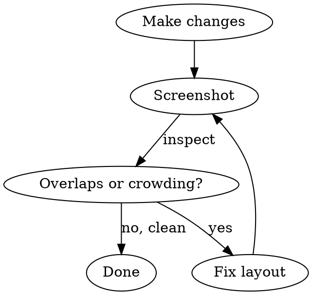

# tldraw Desktop Canvas API

Programmatically create and modify diagrams on the tldraw desktop app via its local HTTP API at `http://localhost:7236`.

**IMPORTANT:** Always use `curl` for all API calls. Do NOT use fetch, wget, or any other HTTP client.

## Workflow

```
1. curl -s http://localhost:7236/api/doc                          → list open docs (get DOC_ID)
2. curl -s http://localhost:7236/api/doc/{id}/shapes              → read current shapes
3. curl -s -X POST http://localhost:7236/api/doc/{id}/actions     → create/modify shapes
4. curl -s http://localhost:7236/api/doc/{id}/screenshot -o f.jpg → verify result visually
```

Always verify your work with a screenshot after making changes. Prefer small, incremental batches.

## Overlap Check — MANDATORY after every batch of changes

After creating or modifying shapes, you MUST:

1. Take a screenshot and visually inspect for overlapping shapes, crossing arrows, or crowded text
2. If overlaps or readability issues are found, fix them using `place`, `move`, `stack`, `align`, or `distribute`
3. Take another screenshot to confirm the fix



**Common overlap fixes:**
- Shapes stacked on top of each other → use `stack` with `gap: 80` or `place` with `sideOffset: 80`
- Arrows crossing through unrelated shapes → `move` the blocking shape out of the path, or use `kind: "elbow"` for right-angle routing
- Text labels overlapping → make shapes wider (`resize` or `update` with larger `w`) or increase gap between shapes
- Dense diagrams → split into rows/columns using `stack` + `align`, or increase spacing with `distribute`

## Quick Reference

### Endpoints

| Method | Endpoint | Description |
|--------|----------|-------------|
| GET | `/api/doc` | List open docs. Filter: `?name=` |
| GET | `/api/doc/:id/shapes` | All shapes on current page |
| GET | `/api/doc/:id/screenshot` | JPEG capture. `?size=small\|medium\|large\|full` |
| POST | `/api/doc/:id/actions` | Structured actions (see below) |
| POST | `/api/doc/:id/exec` | Run arbitrary JS against tldraw Editor |

### Shape Types

| Type | Key Properties |
|------|---------------|
| `rectangle`, `ellipse`, `triangle`, `diamond`, `hexagon`, `pill`, `cloud`, `star`, `heart`, `pentagon`, `octagon`, `x-box`, `check-box`, `trapezoid`, `parallelogram-right/left`, `fat-arrow-right/left/up/down` | `shapeId, x, y, w, h, color, fill, text, note` |
| `text` | `shapeId, x, y, anchor, color, fontSize, maxWidth, text` |
| `arrow` | `shapeId, fromId, toId, color, kind (arc\|elbow), text, bend` |
| `line` | `shapeId, x1, y1, x2, y2, color` |
| `note` | `shapeId, x, y, color, text` (sticky note) |
| `pen` | `shapeId, points:[{x,y}], color, style (smooth\|straight), closed, fill` |

**Colors:** red, light-red, green, light-green, blue, light-blue, orange, yellow, black, violet, light-violet, grey, white
**Fill:** none, tint, background, solid, pattern
**Anchor (text):** top-left, top-center, top-right, center-left, center, center-right, bottom-left, bottom-center, bottom-right

### Actions

POST to `/api/doc/:id/actions` with `{"actions": [...]}`. All actions in one request = single undo step.

| Action | Payload |
|--------|---------|
| `create` | `{"_type":"create","shape":{...}}` |
| `update` | `{"_type":"update","shape":{"shapeId":"id","_type":"rect",...changed props}}` |
| `delete` | `{"_type":"delete","shapeId":"id"}` |
| `clear` | `{"_type":"clear"}` |
| `label` | `{"_type":"label","shapeId":"id","text":"new text"}` |
| `move` | `{"_type":"move","shapeId":"id","x":N,"y":N,"anchor":"center"}` |
| `place` | `{"_type":"place","shapeId":"id","referenceShapeId":"ref","side":"right","align":"center","sideOffset":20}` |
| `align` | `{"_type":"align","shapeIds":[...],"alignment":"center-horizontal"}` |
| `distribute` | `{"_type":"distribute","shapeIds":[...],"direction":"horizontal"}` |
| `stack` | `{"_type":"stack","shapeIds":[...],"direction":"vertical","gap":20}` |
| `resize` | `{"_type":"resize","shapeIds":[...],"scaleX":2,"scaleY":1.5}` |
| `rotate` | `{"_type":"rotate","shapeIds":[...],"degrees":45}` |
| `bringToFront` | `{"_type":"bringToFront","shapeIds":[...]}` |
| `sendToBack` | `{"_type":"sendToBack","shapeIds":[...]}` |
| `pen` | `{"_type":"pen","shapeId":"id","points":[{"x":0,"y":0},...],"color":"black","style":"smooth"}` |

**place sides:** top, bottom, left, right
**align options:** top, center-vertical, bottom, left, center-horizontal, right

## Best Practices

- **Always use `curl`** for all HTTP calls — no exceptions
- **Default shape size:** ~300x200 with ~200 gap between shapes
- **Connect shapes with arrows:** use `fromId`/`toId` — arrows stay attached when shapes move
- **Prefer high-level actions** (`place`, `stack`, `align`) over manual coordinate math
- **Batch actions** in a single POST for atomic undo/redo
- **Use `place`** to position shapes relative to each other instead of calculating coordinates
- **Default styles:** black, medium, draw style, centered text, no fill — unless there's a reason to change
- **Fill recommendations:** `none` for outlines, `solid` for tinted backgrounds
- **Screenshot after changes** to verify layout and check for overlaps
- **Assign readable shapeIds** (e.g., `"auth-box"`, `"db-node"`) for easier reference
- **Large diagrams (7+ shapes):** build in stages — create a few shapes, screenshot, adjust layout, then add more

## Example: Creating a Flowchart

```bash
DOC_ID="your-doc-id"
BASE="http://localhost:7236/api/doc/$DOC_ID"

# Create shapes + connect with arrows in one call
curl -s -X POST "$BASE/actions" \
  -H "Content-Type: application/json" \
  -d '{
    "actions": [
      {"_type":"create","shape":{"_type":"rectangle","shapeId":"start","x":100,"y":100,"w":300,"h":200,"text":"Start"}},
      {"_type":"create","shape":{"_type":"diamond","shapeId":"decision","x":100,"y":400,"w":300,"h":200,"text":"Condition?"}},
      {"_type":"create","shape":{"_type":"rectangle","shapeId":"end","x":100,"y":700,"w":300,"h":200,"text":"End"}},
      {"_type":"create","shape":{"_type":"arrow","shapeId":"a1","fromId":"start","toId":"decision"}},
      {"_type":"create","shape":{"_type":"arrow","shapeId":"a2","fromId":"decision","toId":"end","text":"Yes"}}
    ]
  }'

# MANDATORY: Screenshot to check for overlaps
curl -s "$BASE/screenshot?size=medium" -o screenshot.jpg
# Inspect the screenshot — if shapes overlap or arrows cross, fix with place/move/stack
```

## Exec API

For advanced operations not covered by structured actions:

```bash
curl -s -X POST "$BASE/exec" \
  -H "Content-Type: application/json" \
  -d '{"code": "return editor.getCurrentPageShapeIds().size"}'
```

Full SDK docs available at: `curl -s http://localhost:7236/api/llms`
